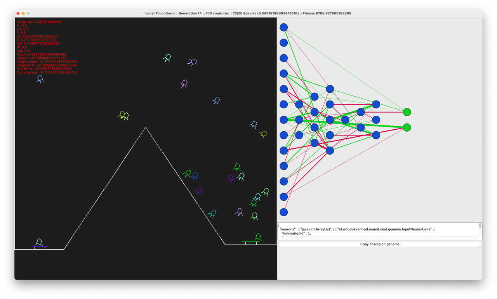
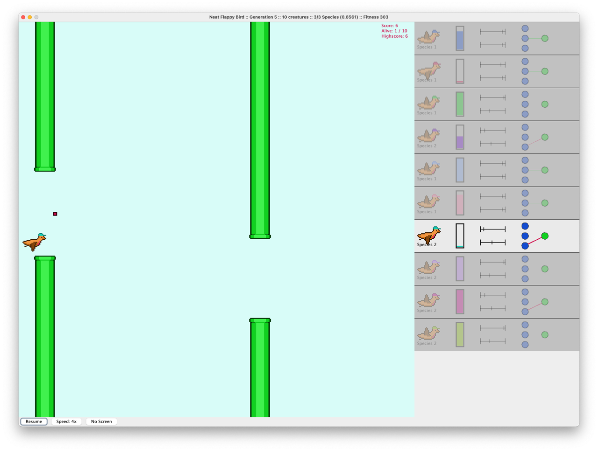

# NEAT Java Implementation

This repository provides a pure Java implementation of the NEAT algorithm. The codebase implements the core NEAT
algorithms and data structures, including genome representation, innovation tracking, topology mutations, speciation,
and evolutionary loops. It also contains a basic neural network implementation to turn genomes
into an actual runnable neural network.

## What is NEAT?

NEAT (NeuroEvolution of Augmenting Topologies) is an evolutionary algorithm for optimizing both the weights and the
structure (topology) of neural networks. Key features:

* **Topology evolution**: Starts with minimal networks and gradually adds neurons and connections.
* **Historical marking**: Tracks structural innovations with innovation numbers to align genomes for crossover.
* **Speciation**: Groups similar networks into species to preserve diversity and protect new innovations.
* **Complexification**: Networks grow in complexity over generations, enabling discovery of task-appropriate
  architectures.

NEAT was [introduced](http://nn.cs.utexas.edu/downloads/papers/stanley.ec02.pdf) by Kenneth Stanley and Risto
Miikkulainen in 2002.

## Highlights and Technical Details

* **Highly Configurable**: Expose all NEAT parameters for your experimentation (
  see [Configuration](docs/configuration.md)
  docs)
* **Speciation**: Implements distance metric with excess, disjoint, and weight-difference terms; adjustable thresholds.
* **Mutations**: Supports single or multiple mutations per genome; configurable probabilities for each operator.
* **Crossover**: Aligns matching genes by innovation IDs, handles excess/disjoint genes, respects disable flags,
  and supports interspecies crossover.
* **Deterministic Innovation IDs**: Assigns unique, monotonically increasing IDs for neurons and connections, with
  thread-safe maps and tables.
* **Neural Networks**: `Network` builds a neural network from a `Genome`, supports cloning, forward evaluation with
  sigmoid activation, and caching for repeated reads.
* **Serialization** Save and load your best performing genomes or use them as a starter for your next evolution.
* **Comprehensive Tests**: Over 50 unit tests covering unit properties, fuzz testing, edge cases, and regression
  scenarios.

## Examples

### [Lunar Lander](https://github.com/wdudokvanheel/neural-neat-lunar)

In this project the NEAT library tries to find a neural network that can fly and safely land a lunar lander, while
avoiding a big randomized mountain. All in true 80s arcade style graphics.



### [Flappy Bird](https://github.com/wdudokvanheel/neural-neat-flappy)

This project is a simple example of NEAT in action, visualizing the learning capabilities of the algorithm. It tries to
learn a bird how to navigate an always changing *Flappy Bird* level.



### [XOR Benchmark](https://github.com/wdudokvanheel/neural-neat-xor)

Check out this project for a minimal example on how to utilize the library. Median generations-to-solve hovers around
19 generations with a >99.9% solve rate.

```
Statistics for 1000/1000 (100.00%) successful runs:
  Average generations: 19.83
  Min generations: 4
  Max generations: 47
  Median generations: 19.00
  StdDev generations: 5.57
```

## Getting Started

This library is available on Maven Central and is ready to be dropped in your project. You can also build the
JAR yourself if you prefer.

### Maven

```
    <dependency>
            <groupId>nl.wdudokvanheel</groupId>
            <artifactId>neat</artifactId>
            <version>1.4.4</version>
    </dependency>
```

### Alternatively build JAR yourself

1. **Clone the repository**:

   ```bash
   git clone https://github.com/wdudokvanheel/neural-neat.git
   cd neat-java
   ```
2. **Build library JAR**:

   ```bash
   mvn package
   ```

**Note** The JAR will be available in target/neat-{version}.jar

3. **(Optional) Run tests**:

   ```bash
   mvn test
   ```

## Project Structure

* **neat**: High-level evolution classes (`NeatEvolution`, `NeatContext`, `Neat Configuration`, `Creature`, `Species`).
    * **neat.genome**: Models to represent the Genome (`Genome`, `NeuronGene`, `ConnectionGene`).
    * **neat.service**: Algorithmic services & logic (`InnovationService`, `MutationService`,
      `CrossoverService`, `SpeciationService`, `GenomeComparison`).
    * **neat.mutation**: Mutation operators (`AddNeuronMutation`, `AddConnectionMutation`,
      `ToggleConnectionMutation`, various weight mutations).
* **network**: Simple neural network implementation to convert and run a genome
* **util**: Debug & helper classes

Test suites are provided under `src/test/java`, covering:

* Mutation operator properties and idempotence
* Crossover invariants and weighted selection
* Speciation behavior
* InnovationService determinism and thread-safety
* Forward pass correctness and caching in `Network`
* Integration-level NEAT evolution loop